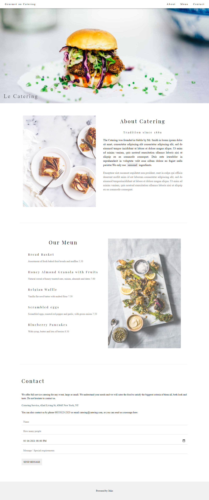

# W3 Schools - Restaurant solution
This is a solution to the [restaurant challenge on W3 Schools](https://www.w3schools.com/w3css/w3css_templates.asp) Gourmet Catering Template.
Essa é uma solução para o ['']('') Gourmet Catering Template.

## Table of contents  -   Tabela de conteudos
- [Overview](#overview) 
  - [The challenge](#the-challenge)
  - [Screenshot](#screenshot)
  - [Links](#links)
- [My process](#my-process)   -   [Meu processo]
  - [Built with](#built-with)
  - [What I learned](#what-i-learned)
  - [Continued development](#continued-development)
  - [Useful resources](#useful-resources)
- [Author](#author)

## Overview   -   Visão Geral


### The challenge   -   O desafio
- Build out the project based on the website provided
- Construa o projeto baseado no website que foi providenciado

### Screenshot   -   Captura de tela



### Links
- Live Site URL: (https://julio-henrique.github.io/gourmet-gatering-html-css/)


## My process


### Built with  - Feito com
- HTML5 
- CSS
- Flexbox


### What I learned  -   Oque eu aprendi
This challenge was great to learn when and how to use the <div> tag, sometimes you want to separate two or more elements in the page, sometimes so that you can apply style, sometimes it's to separate only one element and etc. Ex:
Esse desafio foi ótimo para aprender quando e como usar a tag <div>, as vezes você quer usar para separar dois ou mais elementos na página, as vezes apenas para usar um estilo, as vezes é para separar apenas 1 (um) elemento e etc. Ex:
```html
<div>
  <a href="#home" class="home-link">Gourmet au Catering</a>
</div>
```

In CSS my biggest gain came on how to setup class names and how to use the cascading aspect of CSS to my advantage instead of my fall.
If I saw that some parts of the code were similar, like the title, then I would create one class and apply to everyone, avoiding repetition, DRY.
No CSS o meu maior ganho veio em como organizar os nomes das clases e como usar o aspecto da cascada do CSS para a minha vantagem ao invés de uma desvantagem.
Se eu via que teria algumas partes que o código seria igual, como o titulo, então eu criava uma classe e aplicava para todos, evitando a repetição DRY.

Still CSS - I also learned how to use *flexbox*
Continuando no CSS - Eu também aprendi como usar *flexbox*


### Continued development   -   Desenvolvimento contínuo
I really liked this project :D, my continus growth will go with *flexbox*, after seeing how beatiful the project ended, I decided to continue in this *front-end* path!
Eu gostei muito desse projeto :D, o meu desenvolvimento continuo vai ir com *flexbox*, depois de ver como o projeto ficou tão lindo no final, eu decidi continuar no caminho do *fron-end*


### Useful resources  -   Recursos Úteis
- [CSS resource](https://www.w3schools.com/css/default.asp) - This documentation really helped me. It was easy to read and follow, +1000 stars for them.
- Essa documentação realmente me ajudou. Foi fácil de ler e seguir, +1000 estrelas para eles.


## Author   -   Autor
- Linkedin - [to add](to add)
